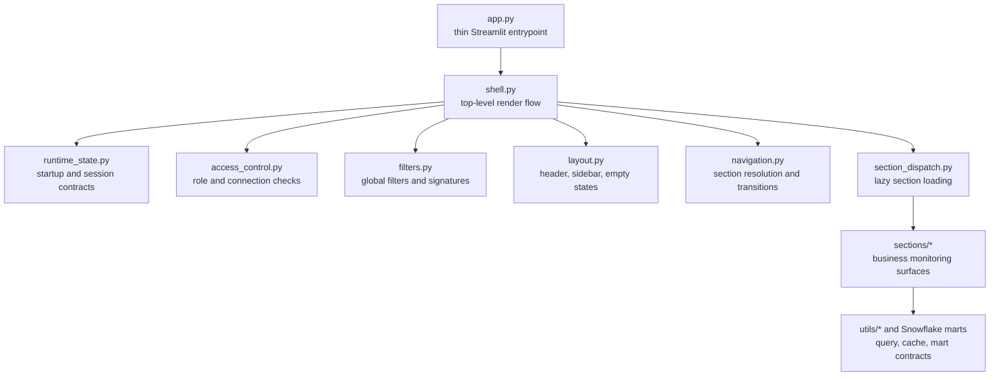

# OVERWATCH App Architecture

Last updated: 2026-06-17

## Purpose

OVERWATCH is a mart-first Snowflake DBA monitoring platform. The Streamlit app
should stay fast on first paint, review-gated for risky actions, and compatible
with Streamlit-in-Snowflake plus local/community wrappers.

## Phase 1 Refactor Map

## Module Responsibilities

| Module | Responsibility | Boundary |
| --- | --- | --- |
| `.overwatch_final/app.py` | Streamlit page config and `render_app()` call only. | No business logic, filters, role checks, or section dispatch. |
| `.overwatch_final/shell.py` | Coordinates startup state, idle pause, access gates, topbar, sidebar, section body, render timing, and error shell. | Orchestration only; no section business logic. |
| `.overwatch_final/runtime_state.py` | App-level session key constants, startup defaults, state helpers, and triage-mode compatibility. | Section-specific state remains in sections. |
| `.overwatch_final/access_control.py` | Snowflake availability probe, current-role seed, admin-role compatibility, and app access decision. | Dangerous actions still require section-level review gates. |
| `.overwatch_final/filters.py` | Company/environment/date/warehouse/user/global scope controls and filter signatures. | Python config remains fallback source for scope lists in Phase 1. |
| `.overwatch_final/layout.py` | Header, sidebar chrome, Settings, Advanced Scope, idle state, connection empty state, admin gate, transition UI. | Does not decide access or execute section logic. |
| `.overwatch_final/navigation.py` | Visible section list, active-section normalization, sidebar navigation state, connection requirement, transition bookkeeping. | In-section workflow jumps stay in `sections/navigation.py`. |
| `.overwatch_final/refresh.py` | Metric settings signature, section render signature, and credit-price state read. | Does not clear section data directly except through callers. |
| `.overwatch_final/section_dispatch.py` | Lazy section import and render dispatch. | `sections.__init__` re-exports for compatibility. |

## Deployment Model

- Streamlit-in-Snowflake remains pinned to `.overwatch_final/app.py`.
- `.overwatch_final/snowflake.yml` now packages the top-level shell modules in
  addition to `app.py`, `config.py`, `theme.py`, `utils/`, and `sections/`.
- The root `streamlit_app.py` wrapper still delegates to `.overwatch_final/app.py`
  for local/community deployment.

## What Changed

- `app.py` was reduced to a thin entrypoint.
- Shell concerns were split into explicit modules for access, navigation,
  filters, layout, runtime state, refresh signatures, and section dispatch.
- Sidebar shell state now returns through a named `SidebarState` contract instead
  of a positional tuple.
- Idle pause now reads cached Snowflake availability and does not trigger the
  shell connection probe while OVERWATCH is idle.
- Shell-layer session state is centralized through `runtime_state.py`; direct
  `st.session_state` access is blocked by tests in shell, layout, filters,
  navigation, access control, refresh, and shared section navigation.
- The existing user-facing navigation labels and section outcomes were
  preserved.
- The existing mart-first philosophy, query tagging, role-gating, idle query
  pause, global filters, executive first-paint intent, and review-gated
  remediation boundary were preserved.
- Tests were updated to assert ownership by module rather than preserving a
  monolithic entrypoint.

## Risks Reduced

- Lower risk that a settings/sidebar change breaks access checks or section
  dispatch.
- Lower risk that Streamlit shell session keys are created in unrelated render
  paths. Section-owned keys still need a phased cleanup.
- Lower risk that idle sessions accidentally wake Snowflake, because paused
  renders use cached/local state only.
- Lower risk that Snowflake connection failures crash the whole shell.
- Easier targeted testing for navigation, filters, access, and packaging.
- Streamlit-in-Snowflake packaging now explicitly includes shell modules.

## Manual Validation Still Needed

- Confirm Streamlit-in-Snowflake deploy picks up all new top-level artifacts.
- Confirm local/community wrapper still opens `.overwatch_final/app.py`.
- Confirm role capture and connection retry behavior inside Streamlit in
  Snowflake, where active-session discovery differs from local testing.
- Validate sidebar navigation, Settings, Advanced Scope, idle resume, and
  connection retry in a live Snowflake account.
- Validate that all six primary sections still render under
  `SNOW_ACCOUNTADMINS` and `SNOW_SYSADMINS`.

## Production-Readiness Checklist

- [ ] `app.py` remains thin and only owns page config plus `render_app()`.
- [ ] `snowflake.yml` includes all top-level shell modules.
- [ ] `MART_PRODUCTION_READINESS_SUMMARY` has recent rows after deployment.
- [ ] `OVERWATCH_PRODUCTION_VALIDATION_STATUS` includes deployment, validation,
  role, privilege, refresh, freshness, config, and environment readiness rows.
- [ ] `MART_EXECUTIVE_SCORECARD_SUMMARY` has recent rows for all six leadership
  scores after `SP_OVERWATCH_REFRESH_EXECUTIVE_SCORECARD()`.
- [ ] `MART_EXECUTIVE_FORECAST_SUMMARY` has recent rows for all seven forecast
  keys after `SP_OVERWATCH_REFRESH_FORECASTING()`.
- [ ] `MART_CHANGE_INTELLIGENCE_SUMMARY` has recent rows for all nine change
  categories after `SP_OVERWATCH_REFRESH_CHANGE_INTELLIGENCE()`.
- [ ] Executive scorecard detail panels are loaded only by explicit operator
  buttons in DBA Control Room, Cost & Contract, Security Monitoring, and Alert
  Center.
- [ ] No section runs live `ACCOUNT_USAGE` queries on first paint unless the
  section explicitly requires a user refresh/load action.
- [ ] Change Intelligence event and correlation evidence remains behind
  explicit Load buttons and keeps `possible correlation` wording.
- [ ] Admin role compatibility still allows `SNOW_ACCOUNTADMINS` and
  `SNOW_SYSADMINS`.
- [ ] Local no-connection mode can show connection-optional shells without
  crashing.
- [ ] Global filter changes invalidate loaded telemetry caches.
- [ ] Settings metric changes invalidate derived dollarized metrics.
- [ ] Idle query pause blocks section Snowflake reads until resumed.
- [ ] Review-gated remediation remains section-owned and does not execute from
  the shell.
- [ ] Section dispatch lazy-loads only the active section.

## Honest Phase 1 Limits

- This was a real complexity reduction for `app.py`, but not a full app-wide
  simplification. Some complexity moved into bounded shell modules so it can be
  tested and replaced safely.
- Shell-level session keys are now registered in `runtime_state.py`; many
  section-specific keys inside individual section modules still need their own
  cleanup passes.
- Snowflake-backed configuration tables are not implemented yet. Python config
  remains the source of truth in Phase 1.
- Live Snowflake calls are still possible from selected sections. The shell
  keeps first-paint and idle behavior bounded, but section-level query audits
  remain important.

## Next Architecture Phases

1. Continue migrating section-level `st.session_state` keys into local section
   contracts or shared `runtime_state.py` keys where they cross boundaries.
2. Add Snowflake-backed configuration tables with Python config as fallback.
3. Introduce first-class OVERWATCH role names while preserving current admin
   compatibility.
4. Phase 2A production readiness is implemented through
   `MART_PRODUCTION_READINESS_SUMMARY`,
   `OVERWATCH_PRODUCTION_VALIDATION_STATUS`, and
   `docs/PRODUCTION_READINESS.md`. Future architecture phases should build on
   that contract rather than adding new first-paint probes.
5. Phase 2B Executive Scorecard is implemented through
   `MART_EXECUTIVE_SCORECARD_SUMMARY`,
   `OVERWATCH_EXECUTIVE_SCORECARD_HISTORY`, and
   `docs/EXECUTIVE_SCORECARD.md`; it should remain mart-first and should not
   become a section-level live-query score synthesizer.
6. Phase 2C Forecasting is implemented through
   `MART_EXECUTIVE_FORECAST_SUMMARY`, `OVERWATCH_FORECAST_HISTORY`, and
   `docs/FORECASTING.md`; forecast details stay behind explicit Load buttons
   and forecasted savings must not be counted as verified value.
7. Phase 2D Change Intelligence is implemented through
   `MART_CHANGE_INTELLIGENCE_SUMMARY`, `OVERWATCH_CHANGE_EVENT`,
   `OVERWATCH_CHANGE_CORRELATION`, and `docs/CHANGE_INTELLIGENCE.md`; evidence
   and correlation detail stay behind explicit Load buttons, and the app must
   use `possible correlation` unless separate proof exists.
