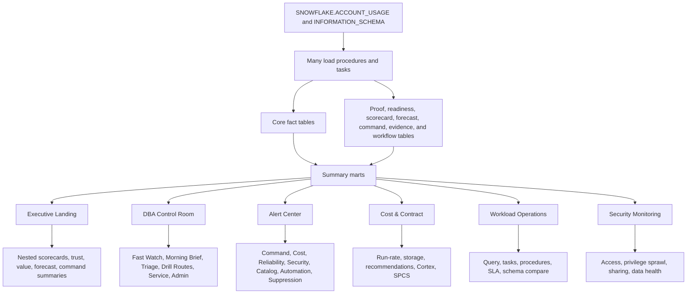
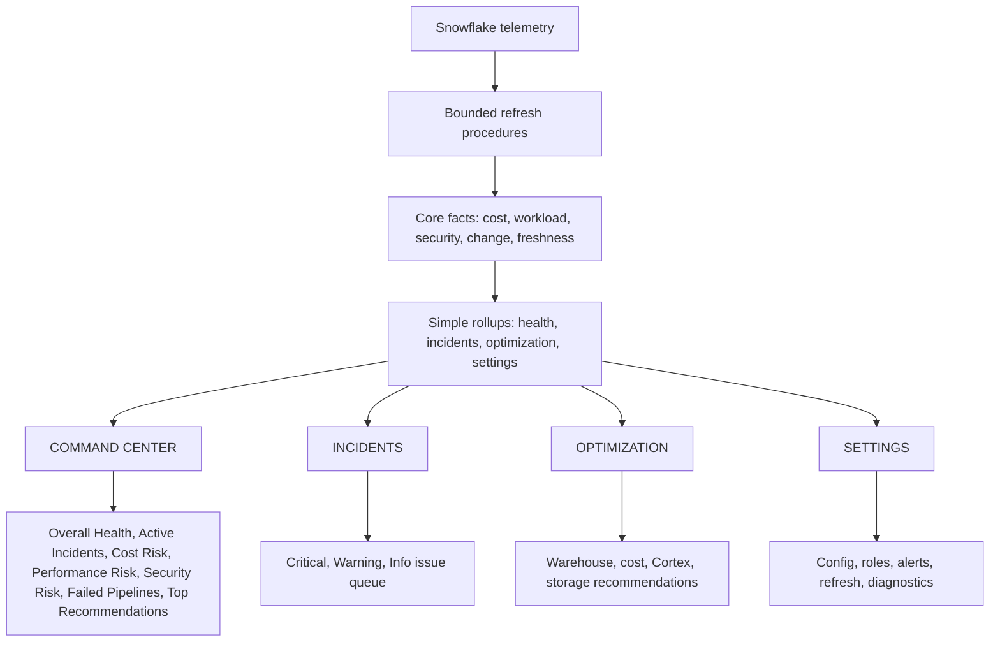
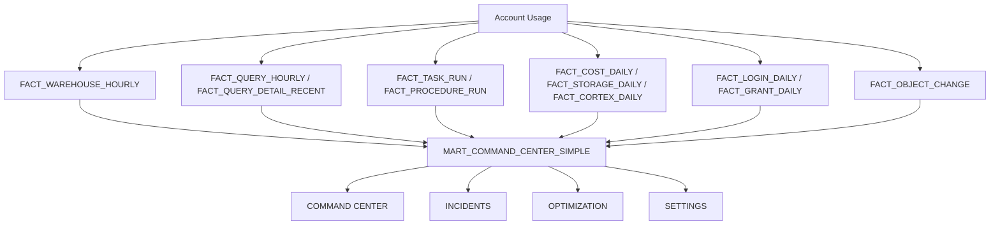

# OVERWATCH Simplification Audit

Date: 2026-06-22

Purpose: reduce OVERWATCH from a feature-rich engineering workbench into a focused Snowflake operations command center for DBAs, data engineers, platform owners, and IT managers.

> Current product direction: keep the six primary sections (`Executive Landing`,
> `DBA Control Room`, `Alert Center`, `Cost & Contract`,
> `Workload Operations`, `Security Monitoring`). Use this audit as a historical
> inventory of internal fluff to hide, simplify, or move behind advanced/admin
> expanders. Do not use the four-area consolidation as the active direction.

## Executive Decision

OVERWATCH should be simplified aggressively.

The current application has valuable telemetry, but too much of the user experience is organized around how the system was built instead of how operators make decisions. The top-level navigation has already been reduced to six sections, but each section still exposes too many secondary workflows, proofing panels, derived metrics, score layers, and detail paths.

Revised target:

- Six clear DBA sections: `Executive Landing`, `DBA Control Room`, `Alert Center`, `Cost & Contract`, `Workload Operations`, `Security Monitoring`.
- Cleaner section entry points that put practical workflows before scorecards, readiness panels, proofing, and evidence widgets.
- One simplified alert model: `Critical`, `Warning`, `Info`.
- One simplified health model: `Critical`, `Warning`, `Healthy`.
- A reduced mart layer of approximately 28 to 34 tables, down from about 94 tables.
- Proofing, readiness, validation, and migration tools moved out of daily operator workflow.

## Current Architecture Diagram

## Simplified Architecture Diagram

## Phase 1 Audit Findings

### Product Reality

The useful product is:

- Is Snowflake healthy?
- What is broken?
- What is expensive?
- What changed?
- What needs attention?

The current product also tries to be:

- A governance evidence platform.
- A readiness scoring system.
- A proof-of-value ledger.
- A change-correlation engine.
- A closed-loop operations framework.
- A Snowflake validation harness.
- A DBA utility workbench.
- A cost allocation and forecasting lab.

Those secondary systems are not worthless, but they should not be daily operator navigation.

### Visible Navigation Inventory

| Item | Current user value | Complexity cost | Decision | Recommendation |
| --- | --- | --- | --- | --- |
| Executive Landing | High, but currently too broad | High | MERGE | Rename and reshape into `OVERWATCH COMMAND CENTER`. |
| DBA Control Room | High, but overloaded | Very high | MERGE | Split into `COMMAND CENTER`, `INCIDENTS`, and `SETTINGS`. |
| Alert Center | High | High | SIMPLIFY | Become `INCIDENTS`; hide catalog, automation, suppression under settings. |
| Cost & Contract | High | High | MERGE | Become `OPTIMIZATION`; focus on spend, warehouse, Cortex, storage actions. |
| Workload Operations | High | High | MERGE | Become workload category inside `INCIDENTS`; keep query/task/procedure triage. |
| Security Monitoring | Medium to high | Medium | MERGE | Become security category inside `INCIDENTS`; settings for access config. |

### Existing Section and Page Inventory

| Current module or page | Likely use | Value | Maintenance cost | Decision |
| --- | --- | --- | --- | --- |
| `executive_landing.py` | Daily | High | High | MERGE into `OVERWATCH COMMAND CENTER`. |
| `dba_control_room` package | Daily | High | Very high | MERGE into command center and incident queue. |
| `alert_center.py` | Daily | High | High | SIMPLIFY into one incident inbox. |
| `cost_contract.py` | Weekly/daily for cost owners | High | Very high | MERGE into optimization workspace. |
| `workload_operations.py` | Daily | High | Medium | MERGE into incidents with workload filters. |
| `security_posture.py` | Weekly/daily for security incidents | Medium | High | MERGE into incidents and settings. |
| `warehouse_health.py` | Daily/weekly | High | Very high | MERGE into optimization. |
| `cost_center.py` | Weekly | High | High | MERGE into optimization. |
| `recommendations.py` | Weekly/daily | High | Medium | MERGE into optimization top recommendations. |
| `storage_monitor.py` | Weekly/monthly | Medium | Low | MERGE into optimization. |
| `cortex_monitor.py` | Increasing value | Medium/high | Medium | SIMPLIFY into Cortex spend risk inside optimization. |
| `spcs_tracker.py` | Rare unless SPCS is adopted | Low | Low | REMOVE from primary UI; keep optional diagnostics. |
| `task_management.py` | Daily when pipelines fail | High | High | MERGE into incidents. |
| `pipeline_health.py` | Daily when pipelines fail | High | Medium | MERGE into incidents. |
| `stored_proc_tracker.py` | Weekly/incident | Medium | Medium | MERGE into pipeline/workload incidents. |
| `query_analysis.py` | Incident-driven | High | Medium | KEEP as workload incident detail. |
| `query_search.py` | Incident-driven | Medium | Low | MERGE into query investigation. |
| `query_workbench.py` | DBA utility | Medium | Medium | MOVE to settings/admin tools. |
| `contention_center.py` | Incident-driven | High | Medium | MERGE into workload incident details. |
| `live_monitor.py` | Incident-driven | Medium | Low | MERGE into incidents. |
| `detailed_diagnosis.py` | Incident-driven | Medium | Low | MERGE into query investigation. |
| `change_drift.py` | Incident-driven | Medium | High | SIMPLIFY into "What changed?" panel. |
| `object_change_monitor.py` | Incident-driven | Medium | Low | MERGE into change panel. |
| `account_health.py` | Daily/weekly | Medium | Very high | MERGE only the useful morning brief signals into command center. |
| `service_health.py` | Daily | Medium | Low | MERGE into command center health. |
| `usage_overview.py` | Weekly | Medium | Low | MERGE into command center or optimization. |
| `security_access.py` | Weekly/security review | Medium | Medium | MERGE into security incidents/settings. |
| `data_sharing.py` | Security-driven | Medium | Low | MERGE into security incidents. |
| `adoption_analytics.py` | Rare for target users | Low | Low | REMOVE from operator UI. |
| `platform_topology.py` | Rare | Low | Low | MOVE to settings/admin diagnostics or remove. |
| `native_monitoring.py` | Rare | Low | Low | REMOVE from primary UI. |
| `dba_tools.py` | Utility-driven | Medium | Very high | MOVE schema compare/data compare to settings/admin tools. |

### Current Workflow Inventory

| Area | Current workflows | Decision |
| --- | --- | --- |
| DBA Control Room | Fast Watch, Morning Brief, Operations Detail, Triage, Drill Routes, Service Posture, Admin Tools | MERGE into command center plus incident queue. |
| DBA Control Room details | Failed Queries, Task Failures, Task SLA/Cost, Procedure SLA/Cost, Cortex Cost, Failed Logins, Object Changes, Action Queue | MERGE into incident categories. |
| Alert Center | Command Center, Cost & Behavior, Reliability, Security, Detection Catalog, Delivery & Automation, Suppression Windows | SIMPLIFY to incidents; move catalog/delivery/suppression to settings. |
| Cost & Contract | Usage attribution, Storage cost, Recommendations, AI/Cortex, SPCS | MERGE into optimization; remove SPCS unless actively used. |
| Workload Operations | Query investigation, Task & procedure health, Stored procedures, Pipeline/SLA risk, Schema & data compare | MERGE into incidents; move schema compare to settings/admin. |
| Security Monitoring | Access posture, Privilege sprawl, Data sharing exposure, Data Health | SIMPLIFY to security incident risk; move data health to settings. |
| Account Health | Overview, Morning Report | MERGE useful signals into command center. |

## Phase 2 User-First Redesign

### New Navigation

| New area | Question answered | Includes | Excludes |
| --- | --- | --- | --- |
| COMMAND CENTER | Is Snowflake healthy? What needs attention now? | Overall health, active incidents, cost risk, performance risk, security risk, failed pipelines, top recommendations | Deep evidence, proof workflows, validation details |
| INCIDENTS | What is broken? What changed? Who owns it? | Critical/warning/info issue queue, workload failures, security issues, cost anomalies, recent changes | Catalog management, scoring frameworks |
| OPTIMIZATION | What is expensive? What can we fix? | Warehouse sizing, cost recommendations, Cortex spend, storage growth, verified high-value actions | Value ledger proof workflow, excessive forecasts |
| SETTINGS | How is OVERWATCH configured and maintained? | Roles, alerts, refresh, email, company scope, warehouse settings, diagnostics, schema compare | Daily operator triage |

### Command Center First Screen

The first screen should fit on a standard desktop with no scrolling:

- Overall Health: Critical, Warning, or Healthy.
- Active Incidents: count by Critical/Warning/Info.
- Cost Risk: current month spend, run-rate, anomaly indicator.
- Performance Risk: queue pressure, failed/slow queries, warehouse saturation.
- Security Risk: failed logins, privilege change, sharing exposure.
- Failed Pipelines: failed tasks/procedures/load jobs.
- Top Recommendations: maximum five, sorted by urgency and savings/risk avoided.

No evidence drawers, no proof tables, no abstract readiness scores on first paint.

## Phase 3 Mart Reduction Plan

### Current Object Footprint

Observed from `snowflake/OVERWATCH_MART_SETUP.sql`:

- About 94 tables.
- 3 views.
- 17 procedures.
- 14 tasks.
- 1 helper function.

Target footprint:

- 28 to 34 tables.
- 2 to 4 views.
- 6 to 8 procedures.
- 5 to 7 tasks.

### Mart Dependency Diagram

### Core Mart Set to Keep

| Object | Decision | Reason |
| --- | --- | --- |
| `OVERWATCH_SETTINGS` | KEEP | Required for app config. |
| `OVERWATCH_SCHEMA_MIGRATION` | KEEP | Required for deployment state. |
| `OVERWATCH_LOAD_AUDIT` | KEEP | Required for refresh diagnosis, but settings-only. |
| `OVERWATCH_USAGE_LOG` | KEEP | Useful app usage/audit table. |
| `OVERWATCH_ADMIN_ACTION_AUDIT` | KEEP | Required for admin safety. |
| `OVERWATCH_ACTION_QUEUE` | SIMPLIFY | Keep one action queue; remove multi-table closed-loop proof system. |
| `OVERWATCH_ALERTS` | KEEP | Primary issue table, if consolidated with `ALERT_EVENTS`. |
| `ALERT_CONFIG` | KEEP | Required alert configuration. |
| `ALERT_THRESHOLDS` | KEEP | Required thresholds. |
| `ALERT_EVENTS` | MERGE | Merge with `OVERWATCH_ALERTS` into one incident event model. |
| `ALERT_ACKNOWLEDGEMENTS` | KEEP | Useful for operator state. |
| `ALERT_OWNER_ROUTING` | KEEP | Directly supports "who owns this?" |
| `ALERT_NOTIFICATION_LOG` | KEEP | Useful for delivery proof, settings-only. |
| `FACT_WAREHOUSE_HOURLY` | KEEP | Core cost/performance telemetry. |
| `FACT_QUERY_HOURLY` | KEEP | Core workload telemetry. |
| `FACT_QUERY_DETAIL_RECENT` | KEEP | Incident details, bounded retention. |
| `FACT_TASK_RUN` | KEEP | Core pipeline telemetry. |
| `FACT_PROCEDURE_RUN` | KEEP | Core stored procedure telemetry. |
| `FACT_COST_DAILY` | KEEP | Core cost telemetry. |
| `FACT_STORAGE_DAILY` | KEEP | Core storage cost telemetry. |
| `FACT_CORTEX_DAILY` | KEEP | Keep as Cortex cost becomes material. |
| `FACT_LOGIN_DAILY` | KEEP | Core security telemetry. |
| `FACT_GRANT_DAILY` | KEEP | Core privilege/security telemetry. |
| `FACT_OBJECT_CHANGE` | SIMPLIFY | Keep for "what changed?", not a full change-intel framework. |
| `FACT_COPY_LOAD_DAILY` | KEEP | Useful for load/pipeline incidents. |
| `MART_DBA_CONTROL_ROOM` | MERGE | Replace with one command center summary. |
| `MART_EXECUTIVE_OBSERVABILITY` | MERGE | Rename/use as simplified command center summary. |

### Candidate Removals or Consolidations

| Object group | Decision | Reason |
| --- | --- | --- |
| `OVERWATCH_EXECUTIVE_SCORECARD_*`, `MART_EXECUTIVE_SCORECARD_SUMMARY` | REMOVE | Six-score framework adds abstraction without a direct operator decision. |
| `OVERWATCH_FORECAST_*`, `MART_EXECUTIVE_FORECAST_SUMMARY` | REMOVE or SETTINGS-ONLY | Forecasting is useful only if it drives an action; otherwise it distracts. |
| `OVERWATCH_CHANGE_RULE`, `OVERWATCH_CHANGE_EVENT`, `OVERWATCH_CHANGE_CORRELATION`, `MART_CHANGE_INTELLIGENCE_SUMMARY` | SIMPLIFY | Keep one object-change feed; remove correlation machinery until users ask for it. |
| `OVERWATCH_ACTION_WORKFLOW`, `OVERWATCH_ACTION_APPROVAL`, `OVERWATCH_ACTION_EXECUTION_PLAN`, `OVERWATCH_ACTION_VERIFICATION`, `OVERWATCH_ACTION_EVIDENCE`, `MART_CLOSED_LOOP_OPERATIONS_SUMMARY` | REMOVE/MERGE | Replace with one action queue plus audit trail. |
| `OVERWATCH_COMMAND_CENTER_QUESTION`, `OVERWATCH_COMMAND_CENTER_FINDING`, `OVERWATCH_COMMAND_CENTER_EVIDENCE`, `OVERWATCH_COMMAND_CENTER_RECOMMENDATION`, `MART_COMMAND_CENTER_SUMMARY` | MERGE | Keep command center output, remove overmodeled question/evidence hierarchy. |
| `OVERWATCH_DATA_TRUST_SOURCE`, `OVERWATCH_DATA_TRUST_STATUS`, `MART_DATA_TRUST_SUMMARY` | SIMPLIFY | Replace with a simple freshness/status field on command center summary. |
| `OVERWATCH_PRODUCTION_CHECKLIST`, `OVERWATCH_ROLE_READINESS_REQUIREMENT`, `OVERWATCH_PRIVILEGE_READINESS_REQUIREMENT`, `OVERWATCH_PRODUCTION_VALIDATION_STATUS`, `MART_PRODUCTION_READINESS_SUMMARY` | MOVE OUT OF APP | This is release management, not daily operations. |
| `OVERWATCH_OPERATIONAL_OWNER_MAP`, `MART_OPERATIONAL_OWNER_COVERAGE`, `OVERWATCH_OWNER_TAG_NAMES`, `DIM_COST_OWNER_TAG` | SIMPLIFY | Keep owner on incidents/actions; remove generic coverage score. |
| `OVERWATCH_VALUE_LEDGER`, `MART_EXECUTIVE_VALUE_LEDGER` | REMOVE/MERGE | Use action queue with expected savings and actual verified savings only when evidence exists. |
| `OVERWATCH_APP_OBSERVABILITY`, `MART_APP_OBSERVABILITY_SUMMARY` | SETTINGS-ONLY | Useful for app owner, not front-line operators. |
| `OVERWATCH_DBA_CHECKLIST_HISTORY`, `OVERWATCH_CHANGE_CONTROL_EVIDENCE`, `OVERWATCH_WAREHOUSE_SETTING_REVIEW`, `OVERWATCH_SECURITY_ACCESS_REVIEW` | MERGE | Replace with one action/audit trail if still needed. |
| `ALERT_NATIVE_OBJECT_REGISTRY`, `ALERT_NATIVE_DEPLOYMENT_REVIEW_V`, `ALERT_REMEDIATION_POLICY`, `ALERT_REMEDIATION_DRY_RUN`, `ALERT_REMEDIATION_LOG`, `OVERWATCH_ALERT_RULE_AUDIT`, `OVERWATCH_ALERT_RULES`, `OVERWATCH_ALERT_DELIVERY_LOG` | SETTINGS-ONLY or REMOVE | Too much alert engineering surface for operators. |
| `OVERWATCH_RECON_CONFIG`, `OVERWATCH_RECON_RUN`, `OVERWATCH_SCHEMA_DIFF_RESULT` | SETTINGS-ONLY | Schema compare is admin utility, not daily monitoring. |
| `FACT_ACCOUNT_HEALTH_OPERABILITY_DAILY`, `FACT_SECURITY_OPERABILITY_DAILY`, `FACT_WAREHOUSE_OPERABILITY_DAILY`, `FACT_CHANGE_CONTROL_OPERABILITY_DAILY` | MERGE | Derived operability scores duplicate command center health. |
| `FACT_COST_SOURCE_HEALTH_DAILY`, `FACT_COST_MONITORING_SIGNAL`, `FACT_COST_INCIDENT_TIMELINE` | MERGE | Use one cost fact plus one incident/action table. |
| `FACT_TASK_CRITICAL_PATH` | SIMPLIFY | Useful only if shown as failed pipeline dependency; otherwise merge into task facts. |
| `DIM_TASK_SNAPSHOT`, `DIM_PROCEDURE_SNAPSHOT`, `DIM_TABLE_SNAPSHOT` | REMOVE unless required for compare | Snapshot dimensions add maintenance cost. |
| `FACT_CHARGEBACK_DAILY` | SIMPLIFY | Keep company allocation if required; avoid broad chargeback product. |

### Procedure Reduction Plan

| Procedure | Decision |
| --- | --- |
| `SP_OVERWATCH_LOAD_HOURLY_UNIT` | KEEP |
| `SP_OVERWATCH_LOAD_HOURLY` | KEEP as wrapper |
| `SP_OVERWATCH_LOAD_DAILY` | KEEP |
| `SP_OVERWATCH_LOAD_CORTEX` | KEEP only if Cortex spend is in scope |
| `SP_OVERWATCH_REFRESH_CONTROL_ROOM` | MERGE into simplified summary refresh |
| `SP_OVERWATCH_REFRESH_COST_MONITORING` | MERGE into simplified optimization refresh |
| `SP_OVERWATCH_REFRESH_EXECUTIVE_OBSERVABILITY` | KEEP/MERGE as command center summary |
| `SP_OVERWATCH_REFRESH_ENTERPRISE_OPERATING_MODEL` | REMOVE |
| `SP_OVERWATCH_REFRESH_PRODUCTION_READINESS` | MOVE to release validation |
| `SP_OVERWATCH_REFRESH_EXECUTIVE_SCORECARD` | REMOVE |
| `SP_OVERWATCH_REFRESH_FORECASTING` | REMOVE or settings-only |
| `SP_OVERWATCH_REFRESH_CHANGE_INTELLIGENCE` | SIMPLIFY |
| `SP_OVERWATCH_REFRESH_CLOSED_LOOP_OPERATIONS` | REMOVE/MERGE |
| `SP_OVERWATCH_REFRESH_COMMAND_CENTER` | SIMPLIFY |
| `SP_OVERWATCH_SEND_ALERT_DIGEST` | KEEP if email alerts remain |
| `SP_OVERWATCH_STAGE_ALERT_REMEDIATION_DRY_RUN` | SETTINGS-ONLY |
| `SP_OVERWATCH_PRUNE` | KEEP |

## Phase 4 Tagging and Classification Simplification

### Decision Rule

For every tag or classification, ask: what decision becomes possible because this tag exists?

If the answer is unclear, remove it from the operator product.

### Keep

| Classification | Purpose |
| --- | --- |
| `Critical` | Requires immediate attention. |
| `Warning` | Needs attention but not immediate interruption. |
| `Info` | Useful context, no urgent action. |
| `Healthy` | No action needed. |
| Company scope: `ALL`, `ALFA`, `Trexis` | Required for cost and ownership filtering. |
| Owner/route | Required to answer "who owns this?" |

### Remove or Hide

| Tag/classification family | Decision | Reason |
| --- | --- | --- |
| Confidence labels on most UI metrics | REMOVE | Operators need certainty/status, not taxonomy. Keep freshness/estimated labels only where needed. |
| Business impact subtypes | SIMPLIFY | Use impact text on incident, not classification trees. |
| Scorecard driver labels | REMOVE | Replace scores with direct incidents and recommendations. |
| Trust/readiness categories | SETTINGS-ONLY | Useful for admins, not operators. |
| Proof/evidence classifications | SETTINGS-ONLY | Keep audit evidence out of daily triage. |
| Native alert deployment classes | SETTINGS-ONLY | Deployment details do not answer operator questions. |
| Forecast quality labels | REMOVE unless forecasts remain | Forecasts should not occupy first-paint experience. |

## Phase 5 Alerting Simplification

### New Alert Model

Every alert must answer:

- Why do I care?
- What is impacted?
- What should I do?

### Keep Alert Types

| Severity | Alert type | Reason |
| --- | --- | --- |
| Critical | Task or pipeline failure | Direct production impact. |
| Critical | Warehouse credit spike or cost anomaly | Direct cost risk. |
| Critical | Cortex spend spike | Likely future cost risk. |
| Critical | Security privilege escalation or risky grant | Direct security risk. |
| Critical | Failed load/copy with downstream impact | Direct operational impact. |
| Warning | Warehouse queue pressure or saturation | Prevents performance incident. |
| Warning | Query failure or duration regression | Supports workload triage. |
| Warning | Stale marts/source freshness | Protects trust in the tool. |
| Warning | Failed login spike | Security monitoring. |
| Info | Object/task/procedure change | Useful in "what changed?" context. |
| Info | Watchlist threshold crossed | Useful only when tied to an action. |

### Remove or Hide Alert Types

| Alert type family | Decision |
| --- | --- |
| Alerts that only prove routing/delivery/catalog health | SETTINGS-ONLY |
| Alerts that do not produce an owner/action | REMOVE |
| Behavior-pattern alerts without an action | REMOVE until concrete operational playbooks exist |
| Native alert deployment review alerts | SETTINGS-ONLY |
| Remediation dry-run logs in main UI | SETTINGS-ONLY |

## Phase 6 Command Center Design

### First Paint Layout

No scrolling on standard desktop.

| Tile | Content | Action |
| --- | --- | --- |
| Overall Health | Critical/Warning/Healthy | Opens incidents filtered to highest risk. |
| Active Incidents | Counts by severity | Opens incident queue. |
| Cost Risk | Current spend, run-rate, anomaly | Opens optimization cost view. |
| Performance Risk | Queue, failed/slow queries, saturation | Opens workload incidents. |
| Security Risk | Failed logins, grant changes, sharing | Opens security incidents. |
| Failed Pipelines | Failed tasks/procedures/load jobs | Opens pipeline incidents. |
| Top Recommendations | Top 5 actions | Opens optimization/action queue. |

### Do Not Show on First Paint

- Score formula details.
- Forecast methodology.
- Value proof ledgers.
- Data trust detail grids.
- Production readiness scoring.
- Validation SQL output.
- Native alert deployment internals.
- Schema compare.
- App self-observability metrics.

## Phase 7 Operator Workflow

### COMMAND CENTER

Default first screen. Answers "what matters now?"

### INCIDENTS

One queue with filters:

- Severity: Critical, Warning, Info.
- Category: Cost, Performance, Security, Pipeline, Change, Data Freshness.
- Company: ALL, ALFA, Trexis.
- Owner: owner or owner gap.

### OPTIMIZATION

One workspace:

- Warehouse sizing.
- Cost anomalies.
- Cortex spend.
- Storage growth.
- Top recommendations.
- Expected savings and verified savings when available.

### SETTINGS

Admin-only:

- Alert email and thresholds.
- Company and warehouse scope.
- Refresh status and idle behavior.
- Role readiness.
- Diagnostics.
- Schema/data compare.
- Validation and deployment runbooks.

## Phase 8 Engineering Vanity List

The following features appear technically interesting but too heavy for the current operator product:

| Feature | Flag | Justification |
| --- | --- | --- |
| Six executive scorecards | ENGINEERING VANITY | Abstract scores hide the actual incident or action. |
| Forecasting suite | ENGINEERING VANITY | Useful only if tied to immediate cost decisions; otherwise it adds uncertainty. |
| Closed-loop operations framework | ENGINEERING VANITY | The tables outgrew the current operator need. Use a simple action queue. |
| Command Center question/evidence/recommendation object hierarchy | ENGINEERING VANITY | Overmodeled for current usage. Keep the command center, simplify the storage. |
| Data Trust Layer as visible product | ENGINEERING VANITY | Freshness matters, but trust taxonomy does not need daily screen space. |
| Production readiness dashboard in operator UI | ENGINEERING VANITY | Release validation is important, but it is not an operator workflow. |
| Ownership coverage scoring | ENGINEERING VANITY | Operators need the owner for this incident, not a coverage report. |
| Value ledger and verification workflow | ENGINEERING VANITY | Keep savings on recommendations; remove proof ceremony until demanded. |
| Alert deployment registry and remediation dry-run UI | ENGINEERING VANITY | Admin implementation detail. |
| Deep Cortex object catalog | ENGINEERING VANITY unless Cortex spend is material | Keep Cortex spend risk, not every AI usage object. |
| SPCS tracker | ENGINEERING VANITY unless SPCS is adopted | Remove from primary navigation. |
| Schema/data compare in daily workflow | ENGINEERING VANITY for monitoring | Move to admin tools. |
| App self-observability as user-facing feature | ENGINEERING VANITY | Keep diagnostics in settings. |

## Page Reduction Plan

| Current concept | New home | Decision |
| --- | --- | --- |
| Executive Landing | COMMAND CENTER | Replace with command center first screen. |
| DBA Fast Watch | COMMAND CENTER | Merge. |
| DBA Morning Brief | COMMAND CENTER | Merge only top actions. |
| DBA Operations Detail | INCIDENTS | Merge. |
| DBA Triage | INCIDENTS | Merge. |
| DBA Drill Routes | INCIDENTS | Remove as separate page. |
| DBA Service Posture | COMMAND CENTER | Merge. |
| DBA Admin Tools | SETTINGS | Move. |
| Alert Command Center | INCIDENTS | Merge. |
| Alert Cost/Behavior | INCIDENTS/OPTIMIZATION | Split by question. |
| Alert Reliability | INCIDENTS | Merge. |
| Alert Security | INCIDENTS | Merge. |
| Alert Detection Catalog | SETTINGS | Move. |
| Alert Delivery/Automation | SETTINGS | Move. |
| Alert Suppressions | SETTINGS | Move. |
| Cost usage/run-rate | OPTIMIZATION | Keep. |
| Storage cost | OPTIMIZATION | Keep simplified. |
| Recommendations/action queue | OPTIMIZATION | Keep simplified. |
| AI/Cortex spend | OPTIMIZATION | Keep simplified. |
| SPCS spend | SETTINGS or remove | Remove from primary. |
| Query investigation | INCIDENTS | Keep. |
| Task/procedure health | INCIDENTS | Keep. |
| Stored procedures | INCIDENTS | Merge. |
| Pipeline/SLA risk | INCIDENTS | Merge. |
| Schema/data compare | SETTINGS | Move. |
| Security posture | INCIDENTS | Merge. |
| Privilege sprawl | INCIDENTS/SETTINGS | Simplify. |
| Data sharing | INCIDENTS | Merge. |
| Data health | SETTINGS | Move. |

## Feature Removal Plan

### Remove from Primary UI Immediately

- Adoption analytics.
- SPCS tracker unless actively used.
- Native monitoring placeholder.
- Platform topology unless tied to an incident.
- Production readiness score.
- Executive scorecard pages and score formulas.
- Forecasting panels.
- Value ledger proof workflow.
- Closed-loop approval/evidence workflow.
- Alert deployment registry/dry-run details.
- Generic ownership coverage reports.

### Move to Settings/Admin

- Schema compare and data compare.
- Role readiness and grant SQL.
- Mart validation results.
- Alert delivery setup.
- Suppression windows.
- Refresh diagnostics.
- App observability.

### Keep and Simplify

- Warehouse advisor.
- Cost metrics.
- Cortex spend risk.
- Failed query/task/procedure detection.
- Security posture alerts.
- Recent changes.
- Owner routing.
- Company split: ALL, ALFA, Trexis.

## Data Source Reduction Plan

### Keep as Core Sources

- `SNOWFLAKE.ACCOUNT_USAGE.WAREHOUSE_METERING_HISTORY`
- `SNOWFLAKE.ACCOUNT_USAGE.WAREHOUSE_LOAD_HISTORY`
- `SNOWFLAKE.ACCOUNT_USAGE.QUERY_HISTORY`
- `SNOWFLAKE.ACCOUNT_USAGE.QUERY_ATTRIBUTION_HISTORY` when available
- `SNOWFLAKE.ACCOUNT_USAGE.TASK_HISTORY`
- `SNOWFLAKE.ACCOUNT_USAGE.TASKS`
- `SNOWFLAKE.ACCOUNT_USAGE.PROCEDURES`
- `SNOWFLAKE.ACCOUNT_USAGE.LOGIN_HISTORY`
- `SNOWFLAKE.ACCOUNT_USAGE.GRANTS_TO_USERS`
- `SNOWFLAKE.ACCOUNT_USAGE.GRANTS_TO_ROLES`
- `SNOWFLAKE.ACCOUNT_USAGE.DATABASE_STORAGE_USAGE_HISTORY`
- `SNOWFLAKE.ACCOUNT_USAGE.STAGE_STORAGE_USAGE_HISTORY`
- `SNOWFLAKE.ACCOUNT_USAGE.COPY_HISTORY`
- Cortex usage histories only for Cortex spend risk.

### Move to Diagnostics or Remove

- `TAG_REFERENCES` except owner/company attribution.
- `OBJECT_DEPENDENCIES` except explicit incident investigation.
- `ACCESS_HISTORY` unless security review requires it.
- Document AI, Snowflake Intelligence, Cortex fine tuning, Cortex search, agents, analyst histories unless in active use.
- Replication, materialized view, dynamic table, pipe, automatic clustering, and SPCS histories unless the company actively uses those features.

## KPI Reduction Plan

### Keep

- Overall health status.
- Active incident count by severity.
- Month-to-date spend and run-rate.
- Warehouse credit anomaly.
- Cortex spend anomaly.
- Queue pressure.
- Failed/slow query count.
- Failed task/procedure/load count.
- Security risk count.
- Recent high-risk changes.
- Last refresh/freshness.
- Top recommendations with expected savings/risk avoided.

### Remove or Hide

- Snowflake Health Score.
- Cost Efficiency Score.
- Security Score.
- Operational Risk Score.
- Data Trust Score.
- Production Readiness Score.
- Forecast confidence scores.
- Ownership coverage score.
- Value verification score.
- App render-time score.
- Proof coverage metrics.

## Implementation Sequence

1. Freeze new feature work.
2. Create the four-area navigation shell behind a feature branch.
3. Build the simplified `OVERWATCH COMMAND CENTER` from existing marts first.
4. Collapse Alert Center into `INCIDENTS`.
5. Collapse Cost & Contract and Warehouse Health into `OPTIMIZATION`.
6. Move schema compare, validation, role readiness, alert setup, and diagnostics into `SETTINGS`.
7. Replace score/status taxonomies with Critical/Warning/Healthy.
8. Create a new slim mart setup script or migration plan.
9. Add a drop script for approved retired objects only.
10. Run production validation with the reduced mart set.

## Estimated Reduction

| Dimension | Current | Target | Estimated reduction |
| --- | ---: | ---: | ---: |
| Top-level user areas | 6 | 4 | 33% |
| Internal page/workflow concepts | 30+ | 8 to 10 | 65% to 75% |
| Tables/marts | about 94 | 28 to 34 | 64% to 70% |
| Procedures | 17 | 6 to 8 | 53% to 65% |
| Tasks | 14 | 5 to 7 | 50% to 64% |
| First-decision clicks | 4 to 8 | 1 to 2 | 60% to 75% |
| Load/detail paths | Very high | Few and explicit | 70%+ |
| Maintenance effort | High | Medium/low | 50% to 65% |

## Recommended Final Product Definition

OVERWATCH is not a governance portal and not a Snowflake encyclopedia.

OVERWATCH should be a Snowflake command center that tells an operator:

1. Something is broken.
2. Something is getting expensive.
3. Something changed.
4. Someone owns it or there is an owner gap.
5. Here is what to do next.

If a feature does not support one of those five outcomes, remove it from the primary product.
