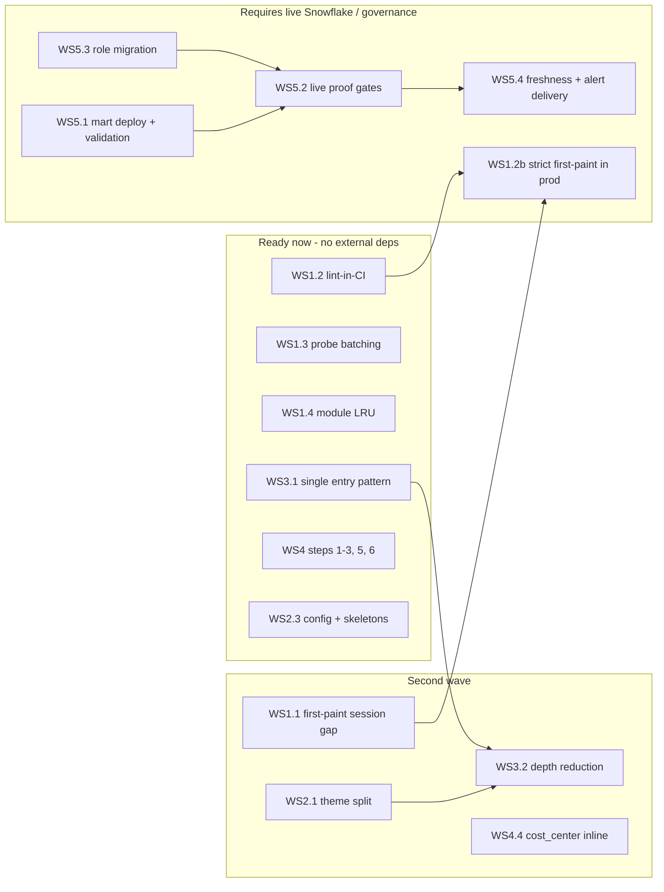

# OVERWATCH Production-Ready / A-Grade Plan

Plan date: July 3, 2026
Baseline: `main` @ `fe50763`
Companion documents: `docs/APP_REVIEW_2026-07.md` (grades and evidence),
`DBA_CONTROL_PLANE_SCORECARD.md` (scoring rubric), `README.md` (production
readiness gates), `docs/PRODUCTION_READINESS.md`.

This is the execution plan to move OVERWATCH from its current **B (78/100)**
overall grade to **A grades across every dimension** and to clear every
externally verifiable production gate. It is organized as six workstreams with
phased steps, explicit exit criteria, dependencies, and risks. Effort is
described by which components change and how invasive the edits are, not by
calendar time.

---

## 1. Where we are (baseline after the July 3 improvement passes)

| Dimension | Review grade | After passes 1–2 | A-grade target |
|---|:--:|:--:|:--:|
| Query performance | A− | A− (cache-key + invalidation + telemetry fixed) | **A** |
| App performance | B+ | B+ (mart tier fixed; cold-start gap remains) | **A** |
| UI / visual system | C+ | C+ (reduced-motion added; monolith remains) | **A−/A** |
| UX / information architecture | B− | B− (dead aliases pruned; depth remains) | **A−/A** |
| Code health / maintainability | B− | B (58 dead files removed; overlaps remain) | **A** |
| Production readiness gates | Conditional Go | Unchanged (live proofs not run) | **Go** |

Already completed (commits `d1979b3`..`fe50763`):

- Cache context now keys on schema scope, exceptions-only mode, and
  credit/AI/storage rates; forced refresh bumps the scoped salt; cache-hit
  telemetry reports real hits; marts read on the 300s `command_summary` tier.
- 58 dead files removed: 6 orphaned standalone sections, the `account_health_*`
  (15) and `change_drift_*` (8) families, `object_change_monitor`, the
  `executive_landing` facade, dead UI helpers, and 2 dead test files — with all
  allowlists/contracts/tests re-synced.
- `cleanup_inventory` now follows dynamic string-based module loads, so the
  repo's own reachability gate is trustworthy.
- `jinja2` pinned; `prefers-reduced-motion` honored; `aria-hidden` misuse
  removed.

Current footprint: 167 files in `sections/`, 92 in `utils/`, `theme.py` at
4,194 lines with 648 `!important` declarations.

---

## 2. What "A" means (exit criteria per dimension)

An A grade is claimed only when every criterion below is demonstrably true and
re-checkable by anyone (test, CI gate, artifact, or documented live proof):

**Query performance = A**
- First paint of every primary section performs at most 1 Snowflake execution
  (the decision packet), enforced — not just recorded — in production.
- No pre-first-paint session opens from the shell path.
- No N+1 metadata probing: column compatibility resolved in ≤1 probe per
  object per session.
- Every `run_query` call site carries an explicit `query_boundary`, and lint
  violations block in CI, not only under `OVERWATCH_TEST_MODE`.

**App performance = A**
- Cold section entry (cached mart) renders the Command Brief in < 1.5s on the
  perf harness; section switch with warm session cache < 300ms
  (`perf_tests/section_smoke_runner.py` + first-paint SLO artifacts).
- Long-lived Streamlit-in-Snowflake workers have bounded module retention.

**UI = A−/A**
- `theme.py` split into ≤ 400-line modules with one token system; `!important`
  count under 200; WCAG AA contrast documented for both themes; minimum 12px
  operational labels; skip-to-main link; Streamlit `config.toml` consistent
  with the default theme.

**UX = A−/A**
- No workflow deeper than 3 levels (sidebar → primary tab → lens) before
  actionable rows; every section uses one entry pattern (shared Command Brief);
  skeleton states cover the packet-load gap; command bar stacks below 900px;
  the IA map (section × workflow) is user-visible.

**Maintainability = A**
- Zero deletion candidates in `cleanup_inventory`; no module family that
  duplicates another's job; every retained module has an owner and route in
  `retained_runtime_modules`; full test suite green in a plain sandbox except
  gates that explicitly require live Snowflake.

**Production ready = Go**
- All seven README gates green, all launch-readiness hard gates pass with live
  Snowflake proofs attached, target roles migrated, and alert delivery
  verified end-to-end.

---

## 3. Workstream 1 — Query & app performance (A− / B+ → A)

### Phase 1.1 — Close the pre-first-paint session gap *(highest-value item)*
- Change `shell.py` / `access_control.refresh_current_role_for_access` so the
  shell never calls `get_session()` before the section's first-paint window.
  Design decision required: role capture must move to the decision-packet
  session open (`get_session(defer_role_capture=True)` already exists) without
  weakening the admin gate. Approach: allow one render with
  `connection_available=True` and unknown role to render the *shell* but keep
  section bodies gated on the packet-captured role, then re-gate on rerun.
- Add a regression test asserting no `record_snowflake_session_open_event`
  fires before `with_section_first_paint_entry` in a scripted shell render.

### Phase 1.2 — Enforce first-paint and lint contracts in production
- Promote `decision_packet` first-paint violations from record-only to
  raising in production (`performance.py:_strict_first_paint_mode`), behind an
  `OVERWATCH_SETTINGS` kill-switch for the first release.
- Make missing `query_boundary` on `_CRITICAL_TTL_BOUNDARIES` call sites a CI
  failure: extend `query_contracts` lint to run over the repo in
  `validate.yml` rather than only at runtime in test mode.

### Phase 1.3 — Kill N+1 metadata probing
- Rework `utils/compatibility.filter_existing_columns` to resolve all
  requested columns for an object with the single `LIMIT 0` probe already
  issued by `get_available_columns`, and only fall back to per-column probes
  when a probe error names a specific column. Cache negative results
  process-wide (exists partially).
- Add a unit test that a loader requesting 7 columns issues ≤ 1 probe.

### Phase 1.4 — Bound long-lived worker memory
- Add an LRU cap (e.g. 8 modules) to `section_dispatch._loaded` with safe
  re-import, and verify with the release-stability perf run
  (`perf_tests/run_release_stability.py`).

### Phase 1.5 — Prove it
- Extend `perf_tests` profiles to record: first-paint query count per section,
  packet latency p50/p95, and section-switch latency; wire the thresholds into
  the launch-readiness first-paint SLO gate so regressions block release.

Exit: all five phases verified by tests/CI artifacts → Query perf **A**, app
perf **A**.

---

## 4. Workstream 2 — UI system (C+ → A−/A)

### Phase 2.1 — Theme decomposition *(largest single UI task)*
- Split `theme.py` into focused modules:
  `theme/tokens.py` (one canonical token set), `theme/streamlit_overrides.py`,
  `theme/components.py` (kit: KPI grids, decision workspace, empty states,
  transitions), `theme/carbon.py`, `theme/terminal.py`, and a thin
  `inject_theme()` assembler. Byte-output equivalence test for the assembled
  CSS during migration (mirror the `mart_setup` split pattern already used for
  SQL).
- Merge the legacy `--bg-*` / `--text-*` tokens and the `--ow-*` compact-shell
  tokens into one namespace; delete the loser after a mapping pass.
- Reduce `!important` from 648 to < 200 by scoping overrides to a
  `body[data-ow-theme=...]` attribute set by `inject_theme()`.

### Phase 2.2 — Accessibility pass
- Raise minimum operational label size to 0.75rem; run and document a WCAG AA
  contrast audit for both themes (muted text `#7b9cab` on `#0B1117` is the
  known suspect); fix failures via token changes only.
- Add a skip-to-main link and a focus target at the section body marker.
- Verify with an axe-core scan in the Playwright smoke run (playwright is
  already a dev dependency).

### Phase 2.3 — Config/theme alignment and skeletons
- Align `.streamlit/config.toml` `base` with the default `carbon` theme (or
  switch the default to `terminal` — one decision, documented).
- Add a Command Brief skeleton state (static HTML using existing
  `ow-kpi-hero-grid` / metric-ribbon classes) shown between the transition
  overlay and the packet response; remove the skeleton on brief render.

Exit: CSS modules ≤ 400 lines each, one token system, `!important` < 200,
documented AA audit, skeletons visible in the demo video → UI **A−**, and **A**
once the axe scan runs in CI.

---

## 5. Workstream 3 — UX / information architecture (B− → A−/A)

### Phase 3.1 — One entry pattern everywhere
- Remove Alert Center's parallel `build_first_paint_summary_spec` /
  `render_section_first_paint_shell` path; the shared Command Brief becomes the
  only section entry surface (contract-tested for all six sections — the
  `ui_kit_command_brief_surface_count == 6` gate already exists).

### Phase 3.2 — Depth reduction in the two heaviest sections
- Alert Center: merge the status lens (Open/Overdue/etc.) into Command Brief
  filters or the primary tabs; collapse the three admin sub-lenses behind one
  "Alert Settings" entry. Target: severity-ranked actionable rows within 3
  clicks from the sidebar.
- DBA Control Room: enforce the scorecard's "3–5 operator metrics before any
  table" budget on Morning Cockpit; move the production-readiness button grid
  and executive scorecard behind a single "Advanced diagnostics" entry
  (pattern already proven in Cost & Contract).

### Phase 3.3 — Orientation and responsiveness
- Stack the 5-column global command bar vertically below 900px (CSS only).
- Surface the IA map: a compact "Where things live" popover fed by
  `route_registry.SECTION_WORKFLOW_CONTRACT`, and a one-time toast when a
  legacy alias resolves ("Opened Workload Operations › Query Investigation").
- Restore a one-line section subtitle under the Command Brief for orientation
  (the old `render_app_header` no-op gets deleted).

Exit: depth ≤ 3 for every workflow, single entry pattern, alias feedback,
narrow-viewport demo recorded → UX **A−**; **A** after a moderated DBA
walkthrough (see WS6 sign-off).

---

## 6. Workstream 4 — Consolidation & maintainability (B → A)

Ordered by risk (lowest first); each step ends with the full suite green and
`cleanup_inventory` at zero deletion candidates.

1. **Merge `service_health` into `dba_control_room/health.py`** — it is only
   reachable from the Control Room Admin expander (1 file removed).
2. **Fold the `warehouse_health_*` render layer into
   `recommendations` / `cost_contract_advisor`** — keep the SQL/dataframe
   helper modules as a library; delete `warehouse_health.render()`-era view
   files that duplicate advisor panels (~8–10 of 18 files removable).
3. **Merge the query-investigation family** — `query_analysis`,
   `query_search`, `detailed_diagnosis`, `query_investigation_root_cause`
   become one package with sub-renderers behind the existing lens pills
   (net −2 files, one alias map instead of three).
4. **Inline `cost_center_*` views into the `cost_contract` workflow package**
   — the largest refactor in this workstream; do it last, view-by-view
   (explorer → burn → chargeback → reconciliation), keeping
   `cost_center_sql`/`cost_center_models` as shared modules until the end.
5. **Utils pruning decisions** — remove or formally retain (with owner/route
   registered): `utils/ask_overwatch.py` (UI is gone), `utils/workload_audit.py`,
   `utils/predictive_sla.py` (test-only callers; may be setup-bundle relevant).
   Clean stale state-key prefixes in `utils/cache.py` that referenced removed
   sections (`ah_`, `lm_`, `uo_`, `aa_`, `change_drift_*`, …).
6. **Docs debt** — update `DBA_CONTROL_PLANE_SCORECARD.md` targets (still lists
   Account Health / Warehouse Health / Change & Drift as sections),
   `OVERWATCH_DOCUMENTATION.md`, and the README quick-start (hard-coded local
   Windows path).

Exit: `sections/` ≤ ~140 files with zero overlapping families, every retained
module owned, docs match the six-section reality → Maintainability **A**.

---

## 7. Workstream 5 — Production launch readiness (Conditional Go → Go)

These are operational gates, not code quality; most require a live Snowflake
account and cannot be closed from a sandbox.

### Phase 5.1 — Deploy and validate the mart
- Run `snowflake/mart_setup/` 01→08 (or `run_mart_setup.sh`) in the target
  account; then run `snowflake/OVERWATCH_MART_VALIDATION.sql` and attach the
  output as the mart-validation proof artifact.

### Phase 5.2 — Live proof gates (currently the only failing tests)
The four `test_launch_readiness` hard gates fail in any offline environment by
design. Close them by running the release-candidate pipeline with
`OVERWATCH_SNOWFLAKE_VALIDATION` / `OVERWATCH_BILLING_RECONCILIATION_PROOF`
enabled against live Snowflake:
1. `snowflake_raw_validation_recheck` — raw validation rows green.
2. `snowflake_execution_validation` — live execution validation for the
   launch profile.
3. `procedure_smoke_call_validation` — live procedure smoke calls
   (`SP_OVERWATCH_*` refresh procedures).
4. `refresh_performance_validation` — FAST/FULL refresh performance proof.
Also complete the billing-reconciliation live run so `production_deployable`
flips true, and capture CI metadata so `ci_artifact_reality_passed` holds.

### Phase 5.3 — Role and access migration
- Create and grant `OVERWATCH_VIEWER`, `OVERWATCH_OPERATOR`,
  `OVERWATCH_ADMIN` per `02_roles_and_grants.sql` through change management;
  move the app off interim `SNOW_ACCOUNTADMINS`/`SNOW_SYSADMINS`.
- Execute `docs/LIVE_ROLE_PROOF_CHECKLIST.md` under each role and attach the
  proof; keep `tests/test_session_role.py` aligned with the new roles and
  update `config.ADMIN_ACCESS_ROLES`.

### Phase 5.4 — Telemetry freshness and alert delivery
- Close the known freshness review item: Trexis coverage at ALFA-equivalent
  expectations (task schedules + `ALERT_DATA_QUALITY_CHECKS` rows for Trexis
  sources), verified by the source-freshness rows in the executive board.
- Send a real alert end-to-end to the approved recipient through
  `ALERT_NOTIFICATION_LOG` and verify acknowledgement/remediation writes.

### Phase 5.5 — Operations hardening
- Dry-run `docs/MART_RESET_RUNBOOK.md` and `docs/OVERWATCH_RECOVERY_RUNBOOK.md`
  in a non-prod account; record gaps found.
- Confirm rollback: previous deployable tag + `rollback_readiness` gate stays
  green after the release-candidate run.

Exit: all README gates and launch-readiness hard gates green with attached
live artifacts → **Go** for broad production.

---

## 8. Workstream 6 — Test, CI, and sign-off hardening

- Keep `validate.yml` (ruff + mypy + compileall + unittest) green on every
  step above; add the repo-wide query-contract lint (WS1.2) and the axe
  accessibility scan (WS2.2) as new CI jobs.
- Add the perf budgets (WS1.5) to CI as soft gates first, hard gates after two
  clean runs.
- Run `perf_tests/section_smoke_runner.py` against a deployed instance for
  every release candidate (exists; make it required).
- Final A-grade sign-off: one moderated walkthrough with the operating DBA
  covering the daily model (README §Daily Operating Model), captured as a
  recording; open findings triaged into the action queue before the grade is
  claimed.

---

## 9. Sequencing and dependencies

Guiding rules:
- Every step lands as its own commit with the full suite green; consolidation
  steps also require a clean `cleanup_inventory` and a GUI smoke video.
- Strict production enforcement (first-paint raising) only ships after the
  session-gap fix and one clean live validation cycle, with a settings
  kill-switch.
- The cost_center inline (WS4.4) and theme split (WS2.1) are the two most
  invasive refactors; neither should overlap the other in the same release.

---

## 10. Risk register

| Risk | Likelihood | Impact | Mitigation |
|---|---|---|---|
| Deferring role capture (WS1.1) weakens the admin gate | Medium | High | Keep section bodies role-gated; add explicit test that non-admin roles never see section data; ship behind kill-switch |
| Theme split visually regresses Streamlit internals | Medium | Medium | Byte-equivalence test during migration; per-section screenshot diff via Playwright |
| cost_center inline breaks deep-link aliases | Medium | Medium | `route_registry` contract tests already cover aliases; migrate view-by-view |
| Strict first-paint raising breaks an untested panel in prod | Low | High | Record-only soak first; kill-switch; violations already logged today |
| Live proof gates surface real formula/freshness defects | Medium | Medium | That is their job — budget an iteration loop between WS5.2 and fixes |
| Role migration blocked by change management | Medium | Low (timing) | Interim admin-pilot roles remain valid; gates track it explicitly |
| Test suite churn from consolidation | High | Low | Pattern proven in passes 1–2: delete dead-family tests, retarget contract tests to focused modules |

---

## 11. Acceptance checklist (grade claims)

- [ ] Query perf A: 1-query first paint enforced, zero pre-paint session opens, ≤1 probe per object, boundary lint in CI.
- [ ] App perf A: packet p95 < 1.5s cold / < 300ms warm on harness; bounded module retention proven in stability run.
- [ ] UI A−/A: theme modules + single token set, `!important` < 200, AA audit documented, skeletons live, axe scan in CI.
- [ ] UX A−/A: ≤3-level depth everywhere, single entry pattern, alias toasts, narrow-viewport support, DBA walkthrough recorded.
- [ ] Maintainability A: zero deletion candidates, no duplicate families, all retained modules owned, docs current.
- [ ] Production Go: mart validated, four live proof gates green, roles migrated with live role proof, Trexis freshness closed, alert delivered end-to-end, runbooks rehearsed, rollback proven.
